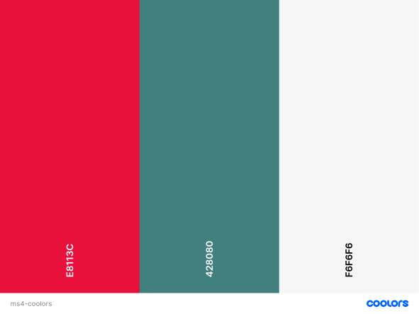
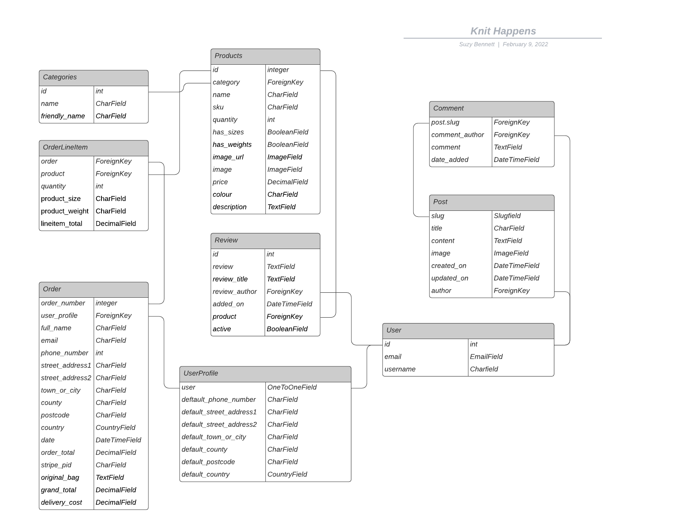

# Knit Happens

## About

**Knit Happens** is an eCommerce site aimed at lovers of knitting looking to find wool, needles and patterns to purchase and allows them to leave blog posts of their creations and find inspiration for their next project. The site is designed to be responsive and easy to navigate on a range of devices to make it easily accessible for all users. 

Link to [live site](https://suzybee-knit-happens.herokuapp.com/)

## **Contents**

- [**UX (User Experience)**](#ux-user-experience)
  - [**User Stories**](#user-stories)
- [**Design Choices**](#design-choices)
  - [**Fonts**](#fonts)
  - [**Colours**](#colours)
  - [**Imagery**](#imagery)
  - [**Wireframes**](#wireframes)
- [**Features**](#features)
  - [**Site Navigation**](#site-navigation)
  - [**Features Implemented**](#features-implemented)
  - [**Future Features**](#future-features)
  - [**Responsive Design**](#responsive-design)
  - [**Defensive Design**](#defensive-design)
- [**Database**](#database)
- [**Technologies**](#technologies)
  - [**Languages**](#languages)
  - [**Frameworks and Libraries**](#frameworks)
  - [**Tools**](#tools)
- [**Testing**](#testing)
- [**Bugs**](#bugs)
  - [**Bugs fixed**](#bugs-fixed)
  - [**Known Bugs**](#known-bugs)
- [**Version Control**](#version-control)
- [**Deployment**](#deployment)
  - [**Running Locally**](#running-locally)
- [**Credits**](#credits)
  - [**Code**](#code)
  - [**Content**](#content)
  - [**Media**](#media)
  - [**Acknowledgements**](#acknowledgements)
  

## **UX (User Experience)**

### **User Stories**

| User Story ID  | As a/an  | I want to be able to...  | So that I can... |
|---|---|---|---|
| Viewing Products & Navigation |
| 1  | User/Shopper | view individual products | identify their qualities and compare. |
| 2  |   | be able to add, edit quantity and remove items from my bag | buy them if after browsing. |
| 3  |   | see any special offers | take advantage of saving money on products I'd like to buy. |
| 4  |   | gain inspiration from the blog | decide what to buy and make next. |
| 5  |   | add posts to the blog | show other users what I have made and gain their opinions through comments. |
| Registration and Accounts |
| 6  | User/Shopper | register for an account | keep track of my orders and check my personal details. |
| 7  |   | receive email confirmation upon signing up | verify my set up was successful. |
| 8  |   | be able to reset my password in case I forget it | gain access to my account. |
| 9  |   | have the ability to log in to the site with my details | view my orders and personal details |
| 10  |   | update my personal details | keep them up to date. |
| 11 |   | purchase from the site without having to create an account | check out quickly and easily. |
| Searching products |
| 12  | User/Shopper | search for specific products | find products I am interested in buying. |
| 13  |   | easily understand the search results | quickly decide which product I want to buy. |
| 14  |   | sort by price, name, category and rating  | view a wide range and choose which to buy. |
| Checkout  |
| 15  | Shopper | have a running total of my bag | stay within my budget. |
| 16  |   | view my bag contents | keep track of which products I have selected. |
| 17  |   | easily select the correct size | ensure I have ordered the right size for my project. |
| 18  |   | adjust the quantity of products to buy | update the order without going back to the product page. |
| 19  |   | easily enter my payment details | checkout as quickly and easily as possible. |
| 20  |   | view the full order before entering card details | check it before confirmation. |
| 21  |   | receive email notifications when I make an order | confirm my order has been placed and refer back to. |
| Admin/Management  |
| 22  | Store owner/Admin | add a product | sell new items in my store  |
| 23  |   | update a product | change descriptions, sizes, images in my store. |
| 24  |   | delete a product | remove items no longer on sale. |

[Back to contents](#contents)

## **Design Choices**

### **Fonts**

The fonts were chosen to complement one another and also give the aesthetic of a fun, knitting store with ['Lobster', cursive](static/docs/images/lobster.png) and ['Libre Franklin', sans-serif](static/docs/images/libre.png) as a contrasting font to help the cursive stand out and allow for extra readability when more information given.

### **Colours**

-  This Coolors palette was used to put together a colour scheme to reflect the different colours of the balls of wool to keep in with the theme of the knitting shop. 
- The original colour scheme was slightly different but due to accessibility reasons this was changed near the end of building this project to improve contrast ratios. Previous colours [here]((static/docs/images/knit-happens-coolors.png)) 

### **Imagery**

The images used were taken from these sources:
- Home page wallpaper by [Nynne Schrøder](https://unsplash.com/photos/nMdC42MrwN8)
- The images of the different kinds and colours of wool were from [Surene Palvie](https://www.pexels.com/@surene-palvie-1075224) 
- The images of knitted garments from [Miriam Alonso](https://www.pexels.com/@miriam-alonso), [Anna Khomutova](https://www.pexels.com/@anna-khomutova-3562984), [Karolina Grabowska](https://www.pexels.com/@karolina-grabowska), [Arina Krasnikova](https://www.pexels.com/@arina-krasnikova) and [Daria Shevtsova](https://www.pexels.com/@daria)

### **Wireframes**

The wireframes were created using [Adobe XD](https://www.adobe.com/uk/products/xd.html) and can be found in pdf form in [wireframes](wireframes).

#### **Desktop view**
- [Home](static/docs/images/wireframes/desktop-home.png)
- [Register](static/docs/images/wireframes/desktop-register.png)
- [Login](static/docs/images/wireframes/desktop-login.png)
- [Profile-Orders](static/docs/images/wireframes/desktop-profile-orders.png)
- [Products](static/docs/images/wireframes/desktop-products.png)
- [Product-Detail](static/docs/images/wireframes/desktop-product-detail.png)
- [Add-Product-To-Bag](static/docs/images/wireframes/desktop-add.png)
- [Processing-Payment](static/docs/images/wireframes/desktop-processing.png)
- [Checkout](static/docs/images/wireframes/desktop-checkout.png)
- [Cart](static/docs/images/wireframes/desktop-cart.png)
- [Confirmed-Order](static/docs/images/wireframes/desktop-confirmed.png)
- [Admin](static/docs/images/wireframes/desktop-admin.png)

#### **Mobile view**

- [Home](static/docs/images/wireframes/mobile-home.png)
- [Register](static/docs/images/wireframes/mobile-register.png)
- [Login](static/docs/images/wireframes/mobile-login.png)
- [Profile](static/docs/images/wireframes/mobile-profile.png)
- [Orders](static/docs/images/wireframes/mobile-orders.png)
- [Edit-Profile](static/docs/images/wireframes/mobile-edit-profile.png)
- [Products](static/docs/images/wireframes/mobile-products.png)
- [Product-Detail](static/docs/images/wireframes/mobile-product-details.png)
- [Add-Product-To-Bag](static/docs/images/wireframes/mobile-add-product.png)
- [Processing-Payment](static/docs/images/wireframes/mobile-payment-processing.png)
- [Checkout](static/docs/images/wireframes/mobile-checkout.png)
- [Cart](static/docs/images/wireframes/mobile-cart.png)
- [Blog](static/docs/images/wireframes/mobile-blog.png)

[Back to contents](#contents)

## **Features**

### **Site Navigation**

The navigation bar displays different links depending on whether the user is logged in, logged out or a super user.

| Link | Not logged in  | Logged in | Logged in as super user |
|---------------|---------------|---------------|-------------|
| Home | &#10003;| &#10003; | &#10003; |
| Log In  | &#10003;  | &#10007;  | &#10007;  |
| Register | &#10003;  | &#10007;  | &#10007;  |
| Profile  | &#10007;  | &#10003;  | &#10003;  |
| Log Out  | &#10007;  | &#10003;  | &#10003;  |
| Search  | &#10003;  | &#10003;  | &#10003;  |
| Blog  | &#10003;  | &#10003;  | &#10003;  |
| Add Product | &#10007; |&#10007;  |  &#10003; |

### **Features Implemented**

##### **Create Profile**
- Users are able to:
  - Create a profile to save their orders and personal information
  - Confirm their details are correct via email verification
  - Store details for faster checkout

##### **Log in to Profile**
- Users are able to:
  - Log in to profile to see their orders and personal information
  - Edit personal information if required

##### **Products Page**
- Users are able to:
  - See the products for sale on the site
  - Sort products by A-Z, Name, Category, Price.
  - See only 12 products at a time to save site loading times
  - Price of product

##### **Product Details Page**
- Users are able to:
  - Click the products to find out more information including
  - Name, Size (if has size), Weight (if has weight), colour, price, SKU, category
  - Add products to bag to buy
  - Find out the needle size of their required product and convert to local using the sizing guide
  - See reviews of products and also review the products if logged in

- Super users are able to:
  - Add, edit and delete products

##### **Products Management**
If the user is a super user they can:
  - Add a product (inc adding image)
  - Edit a product
  - Delete a Product

##### **Bag**
- Users are able to:
  - Adjust number of products in bag if they require
  - Find out delivery costs
  - Find out how much more they need to spend to get free delivery
  - Clearly see the total of their items by quantity and grand total

##### **Checkout**
- Users can:
  - Save time as personal details pulled from profile page if user is logged in
  - Save their delivery information to their profile
  - Clearly see how much they will be charged for their items and delivery

##### **Blog**

- Guest users can:
  - View blog posts

- Logged in users can:
  - Add comments on blog posts
  - Create new blog posts
  - Edit their own blog posts
  - Delete their own blog posts

- Super users are able to:
  - Add, edit and delete any blog posts

##### **Navigation**

**Header**

- All users can:
  - Navigate to home, blog, products, bag pages

- Users logged in can access:
  - Profile pages

- Users not logged in can:
  - Access log in and register pages

**Footer**

- All users can access social media links, terms and conditions and privacy policy pages.

[Back to contents](#contents)

### **Error Pages**

#### *404.html*

 - 404 page created to redirect users back to the main site in case of an error

#### *403.html*

 - 403 page created to redirect users back to the main site in case they try to access a page they are not authorised to

#### *500.html*

 - 500 error page created to redirect users to the main site after a server error

### **Future Features**

- When user logs out their bag is emptied so that when they log bag in the existing items would be in their bag from the previous log in. I would implement a feature where this was saved to the profile. 
- The ability for users to change their username
- A star rating or upvote functionality for the products and blog posts.

### **Responsive Design**

The site was designed to be mobile first as more users are using their handheld devices to shop online but this has been adapted to allow a great experience for desktop users also. 

### **Defensive Design**

- **Form Validation**
  - Form validation has been added to every form to ensure all required information is included before submitting.
  - If incorrect data is input a warning text appears to advise the user how to continue

- **Default Image if none added**
  - In the event that a product or blog post is added without an image a default image will be added.
- **Unauthorised Attempts**
  - An [error](static/docs/images/error.png) is launched if the user attempts to visit a part of the site where they are not authorised 
- **@login_required**
  - @login_required decorator added to restrict access to certain pages.
      - If a logged-out user tries to access a restricted page, they will be redirected to the login page.
      - Only authorised users may perform certain actions: Eg add, edit, delete product and edit, delete blog posts. [Example](static/docs/images/not-post-author.png)
- **Bag**
  - Validation ensures a minimum of 0 product and maximum of 99 products is added to the bag. In the case that 0 is selected the item is removed from the bag.
  - Error message appears if user tries to add negative numbers of items "Value must be greater than or equal to 0"

[Back to contents](#contents)

## **Database**

- [SQLite](https://www.sqlite.org/index.html)
    - Cloud based database to hold the product, user, order and blog fields.
- [Postgres](https://www.postgresql.org/)

### **Database Design**

The database uses SQL through PostgreSQL and were originally formed from fixtures [*categories.json*](products/fixtures/categories.json) and [*products.json*](products/fixtures/products.json)

The Database schema is below

## **Technologies**

### **Languages**

- [HTML5](https://developer.mozilla.org/en-US/docs/Web/HTML)
  - Used as the main markup language for the website content.
- [CSS3](https://developer.mozilla.org/en-US/docs/Web/CSS)
  - Used to style the individual webpages.
- [JavaScript](https://developer.mozilla.org/en-US/docs/Web/JavaScript)
    - Used to show the questions through pagination and for the game play.
- [Python 3](https://www.python.org/)
    - Used to run the site and database

### **Frameworks and Libraries**

- [Bulma](https://bulma.io/)
    - Used to design a mobile-first responsive website layout along with custom components. 
- [Django](https://www.djangoproject.com/)
    - High level framework used for rapid development of the site. 

### **Tools**

- [Git](https://git-scm.com/)
  - Git was used for version control (commit to Git and push to GitHub).
- [GitHub](https://github.com/)
  - Used to store, host and deploy the project files and source code after being pushed from Git. I also used it for the Project Kanban board to keep track and split tasks into smaller tasks to make them easier to fulfill.
- [Gitpod](https://www.gitpod.io/)
  - An online IDE linked to the GitHub repository used to write my code.
- [Heroku](https://www.heroku.com/home)
    - A Cloud Application Platform used to deploy the site
- [AWS](https://aws.amazon.com/)
    - A cloud application to hold media files.
- [Google fonts](https://fonts.google.com/)
  - Used to compare and choose fonts. 
- [Coolors](https://coolors.co/)
  - Used to research and choose the colour scheme by comparing and contrasting similar colours in the generator.
- [Favicons](https://favicon.io/)
  - Used to generate a favicon for the website title.
- [Lighthouse](https://developers.google.com/web/tools/lighthouse)
  - Used to audit the site for quality and ensure responsiveness.
- [amiresponsive](http://ami.responsivedesign.is/)
  - An online tool to check how responsive the site is on different devices.
- [tinypng](https://tinypng.com/)
  - Used to reduce the size of the images for better user experience.
- [JSHint](https://jshint.com/)
    - Used to detect errors in the JavaScript files
- [PEP8 Online](http://pep8online.com/)
    - Used to check PEP8 compliance in the code
- [W3C Markup Validator](https://validator.w3.org/)
    - Markup validation service for HTML5
- [Jigsaw Validator](https://jigsaw.w3.org/css-validator/)
    - CSS3 Validation Service
- [Wave](https://chrome.google.com/webstore/detail/wave-evaluation-tool/jbbplnpkjmmeebjpijfedlgcdilocofh)
    - Accessibility validation service.

[Back to contents](#contents)

## **Testing**

- Testing can be found [here](TESTING.md)

## **Bugs**

### Bugs Fixed 

- Fix for [Favicon 401 error](https://medium.com/@aurelien.delogu/401-error-on-a-webmanifest-file-cb9e3678b9f3) found as resolved using the site linked.
<!-- - Bug using [Bulma columns](https://github.com/jgthms/bulma/issues/449) creates overflow on mobile as there is margin top, left and right of 0.75rem so addressed this in CSS using margin: 0 !important; on columns. -->
- Fix for price negative numbers on Add Product page form found on [Stack Overflow](https://stackoverflow.com/questions/12384460/allow-only-positive-decimal-numbers)

### Known Bugs
- AllAuth automatically logs user out before displaying Sign Out page
- Sorting products works on first page but when clicking next page it stops working.

## **Version Control**

**Version control** was managed within **GitHub** and **Gitpod** and regular commits pushed to **GitHub**. 
See below for how this was managed:

### Gitpod Workspaces
1. Starting from GitHub clone the [Code Institute template](https://github.com/Code-Institute-Org/gitpod-full-template) by clicking Use This Template and copying to my repository under the name ms1-ali-shiatsu. The workspace is then launched by clicking GitPod - this action only needs to be performed once and then workspace reopened from GitPod.
2. Start the Gitpod Workspace which opens an **online IDE editor** window.

### Gitpod branching and committing to GitHub
1. I created various branches to work on different sections of code to push to master. I did this by typing into the terminal the commands: *git status* to find out which branch currently on; *git switch -c <*branchname*>* to create a new branch and switch to it immediately and then once the work was completed on that branch typed *git add <*files to be added*>* , *git commit -m <*commit message*>* and *git push --set-upstream <*remote*> <*branchname*>* to push to GitHub. I then created a pull request to pull the changes to the master if happy with the changes. From this point I would use *git -d <*branchname*>* to delete the local branch and delete the remote branch on GitHub. 
2. Meaningful commit messages were used to allow to roll back any changes made throughout the journey.

[Back to contents](#contents)

## **Deployment**

Click [here](static/docs/testing/DEPLOYMENT.md) to see deployment steps

## **Credits**

### **Code**
- A large portion of the Python code was developed following the Code Institute's [Boutique Ado](https://github.com/Code-Institute-Solutions/boutique_ado_v1/tree/250e2c2b8e43cccb56b4721cd8a8bd4de6686546) walkthrough. 
- CodeInstitute Full Stack Developer Course
- Wes Bos [JavaScript 30](https://javascript30.com/) for extra ideas on using JavaScript
- [Background layout](https://css-tricks.com/perfect-full-page-background-image/) this was taught in one of the Code Institute lessons from css-tricks.com and I use it constantly for my background images. 
- Code taken from Bulma GitHub [thread](https://github.com/jgthms/bulma/issues/2361) to fix the navbar menu always open on mobile.
- Uni-form Crispy Form CSS and JS code taken from the uni-form GitHub [repo](https://github.com/draganbabic/uni-form)
- Code inspiration taken from [CI Student Kyle Lawrence](https://github.com/kylelawrencedev/lawrence-collections-ms4/blob/main/products/views.py) for help with the reviews section. 
- [Code with Stein](https://codewithstein.com/build-a-simple-blog-using-django-3-in-under-20-minutes/) tutorial followed to complete the blog model on the project and some extra information from [jennymalmoe](https://github.com/jennymalmoe/MSP4) fellow student.
- Testing Tools docs [1](https://docs.djangoproject.com/en/4.0/topics/testing/tools/), [2](https://stackoverflow.com/questions/29428894/django-setuptestdata-vs-setup), [3](https://pythoneatstail.com/en/overview-all-articles/testing-custom-user-model-djangos-testing-tools-and-coverage/)
- [Pagination Tutorial](https://simpleisbetterthancomplex.com/tutorial/2016/08/03/how-to-paginate-with-django.html)
- [Stack Overflow](https://stackoverflow.com/questions/54467992/bulma-scale-image-to-container) to help position the images within the cards and ensure any new uploaded products or blog posts had images to fit the columns. 
- Student friend [Abi](https://github.com/Abibubble/ms4-lead-shot-hazard) where I got help with automated testing. 

### **Content**

- Terms and conditions, privacy page sources from https://www.termsfeed.com/

### **Media**

All product images sourced from Pexels
Homepage [image by K8 on Unsplash](https://unsplash.com/photos/uYf_C34PAao)
  
### **Acknowledgements**

- My Mentor for confidence boosting and helpful advice and feedback.
- Friends and family for testing the site and giving feedback on different devices, especially Alasdair and mum for diligently testing and finding things to be fixed.
- @Eventyret_mentor, Amy O'Shea, Iryna, Claire Lemmonaire on Slack who supported me through the journey.
- My husband for all his support, patience and great ideas.
- And, lastly my cheerleader Emanuel Silva for helping me to stay motivated, sharing great ideas and bad jokes to keep us going. 

[Back to contents](#contents)
